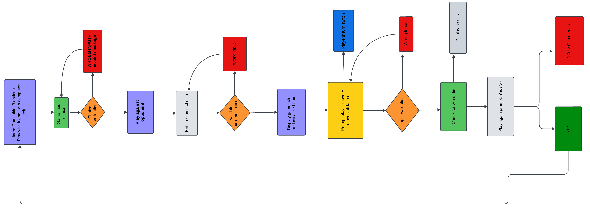
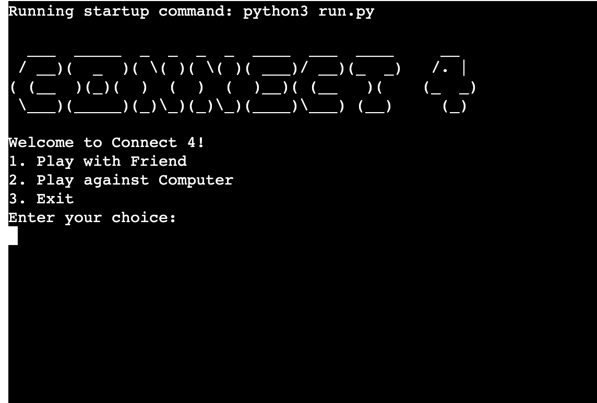
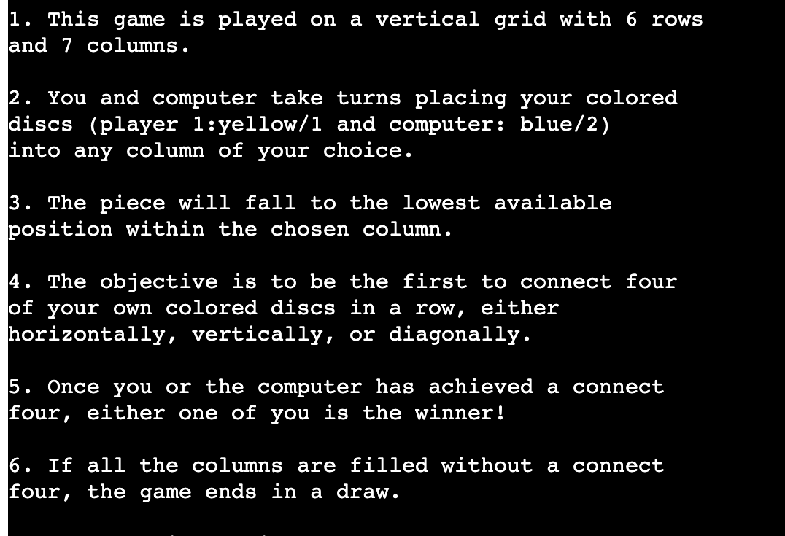
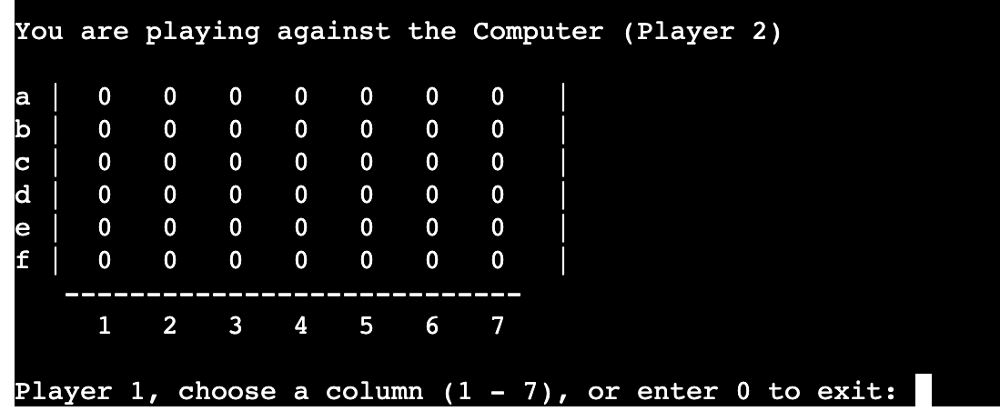
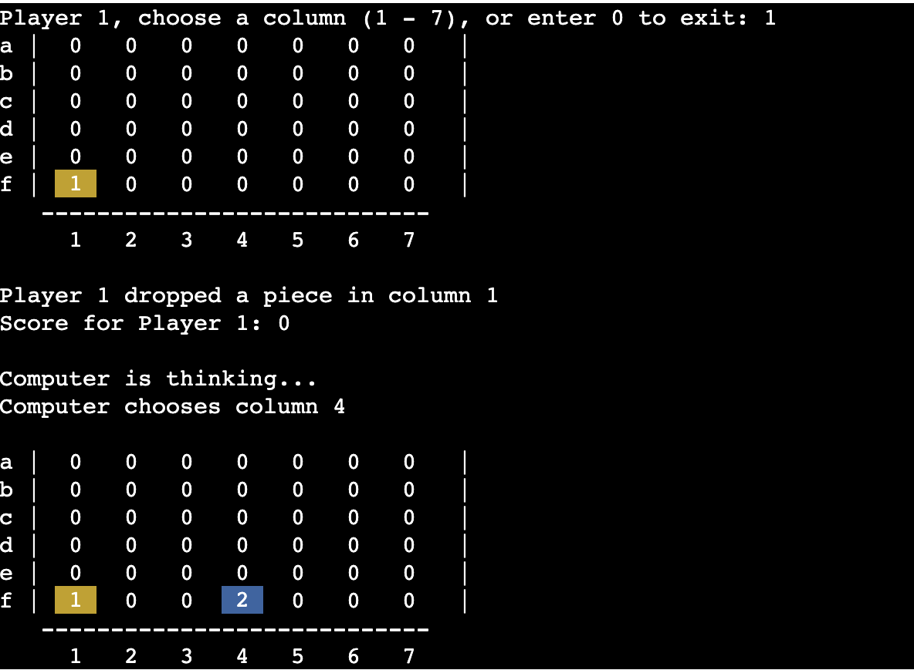
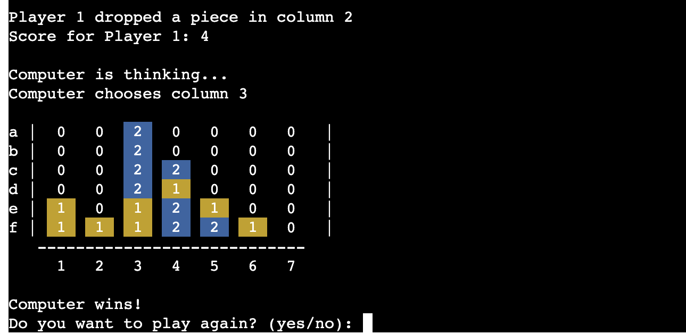
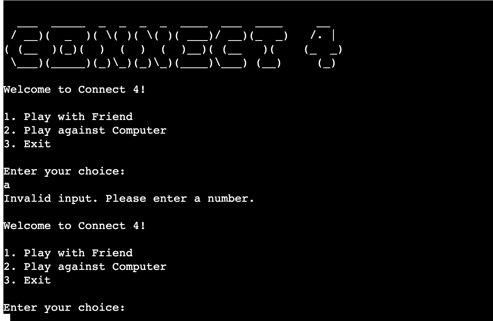
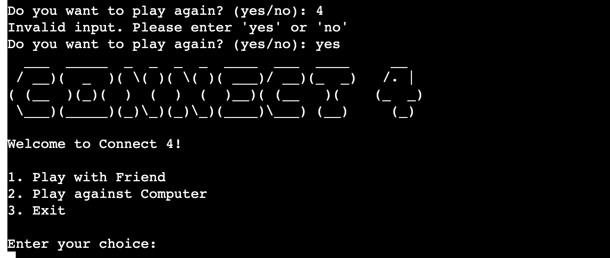

# Connect 4 Game Documentation
# Table of Contents

1. [Introduction](#introduction)
    * [Demo](#demo)
  
2. [Features](#features)

3. [Objectives](#objectives)
    * [Developer's goal](#developers-goal)
    * [User's goal](#users-goal)

4. [Getting Started](#getting-started)
    * [Technologies used](#technologies-used)
        - [Language](#language)
        - [Toolchain](#toolchain)
        - [Necessary imports](#necessary-imports)
    * [Prerequisites and Deployment](#prerequisites-and-deployment)
        - [Installation](#installation)
        - [Local Development](#local-development)
        - [Deploying on Heroku](#deploying-on-heroku)
            - [Essential when creating the Heroku app](#Essentials)
        - [Constraints](#constraints)
5. [Testing](#testing)
6. [Credits](#credits)   

## Introduction

Connect 4 is a classic two-player connection game where players choose a color and take turns dropping colored discs into a grid. The objective is to connect four discs in a row before your opponent does.

### Demo

- [Live Site on Heroku](https://connect-4-pp3-f3bf4c65e965.herokuapp.com/)
- [GitHub Repo](https://github.com/JonFD4/Connect4.git)

## Features

- Text-based interface for easy gameplay.
  - Clean and intuitive user interface.
- Two-player mode or user vs. computer.
- Interactive grid for dropping pieces.
- Win detection for vertical, horizontal, and diagonal connections.
- Clear prompts and visual feedback for an intuitive user experience.

## Objectives

### Developer's goal
**Design**


[Lucid chart planning of game](assets/images/Connect-4-planning.png)
1. **Game Logic Implementation**
   - Develop the core game logic, including rules and turn handling.
2. **User Experience**
   - Create a clean console interface with clear prompts and visual feedback.
3. **Python Skill Development**
   - Provide an opportunity to implement and develop Python skills.

### User's goal

- Play an online game of logic and strategy.
- Choose between computer and another user.
- Identify owned and opponent pieces visually.
- Experience interactive gameplay.
- Exit the game prematurely if needed.
- Know the results at the end of the game.
- Have the option to play again.

## Product Features



    *title and introduction page*
The 'landing page' used pyfiglet to design an ASCII art of 'Connect 4'.
There are 3 options provided: the choice of playing with person, computer or simply exiting.
Underneath is the input that requests user to make a choice.




*Rules page*
Immediately on entering selection, the rules of game are displayed in a list on screen. The slighty different changes depending on whether user is playing with computer or another person.




*Initial board*
A free board is printed out. At the top is a text that informs user of who they are playing with. A prompt also request user to chose a column.
The columns and the rows are labelled to make it readable and easy to for players to choose.



*Turns and color + number representation* In the user vs user play, when each player takes their turn, a piece which is a number with a background color is printed (1/yellow and 2/blue). 
There slightly different features if it is user vs computer play. "Computer is thinking..." which gives the illusion that computer is taking its time to play. Of course, this delayed response is implemented using the time module.
Each turn shows what decision a player made.




*Final piece* 
The final board shows a beautiful display of blues and yellows and choices that have been made.
Underneath it is an output that informs who won. This followed by the `play again` query.


**Input, Input validation, and Error handling**


*Start choice error handling* The user is immediately prompted if the input is invalid. A message is displayed to inform of wrong input, followed by another input asking for choice.


*Wrong column input* Immediately, a response informing user of wrong input, followed by request for input is output for user.



*Play again validation*  play agian feature request either `yes` or `no`. If it is `yes`, they game restarts, displaying the landing page and game mode choices.


*play again error handlin*
If user input the wrong data, the prompt is set up to keep asking until user inserts either `yes` or `no`. 

**Exit Strategies**

*Early exit* This is the third option that is presented when user is choosing a column. `0` allows user to exit befire game ends. 
Additionally, this feature is beneficial during early development when developer wants to make certain test without havig to complete the game. `Exiting the game. Goodbye!`


*play again exit* This removes user from the game completely and outputs a message `Thanks for playing! Exiting...`


# Getting Started

## Technologies Used
### Language
- Python

###  Toolchain
- Lucid chart
- Visual Studio Code - IDE for code development
- GitHub - Version control and repository hosting
- Heroku - Deployment and hosting

### Necessary Imports:
- colorama (Back, Fore, init)
- numpy (generate 2D matrix of zeros)
- pyfiglet (for designing title)
- sys (provides interaction between developer and runtime environment)
- random
- string
- time
- textwrap

## Prerequisites and Deployment

The game was developed in VS Code, stored in GitHub as the local repository, and deployed on Heroku.

### Installation

- Ensure [Python](https://www.python.org/) is installed on your system.
  ```bash
  python --version
  # or
  import sys
  print("Python Version:")
  print(sys.version)
  print("Python Version Info:")
  print(sys.version_info)
  ```
- Depending on Python version, use either `pip` or `pip3` to install libraries and modules.
  ```bash
  pip3 install random
  ```

### Local Development

**Fork the Repository:**
1. Login to GitHub or create a new account.
2. Find the repository of interest.
3. Click on `Fork` in the top right corner.

**Cloning a Repository:**
1. Find the repository of interest.
2. Click the `Code` button in green and select `local`.
3. Click the `copy` button beside the repository link under `HTTP`.
4. In your local IDE, select git clone and paste the link, then select the directory you want it stored in.

Alternatively (Via terminal):
1. Clone the repository.
   ```bash
   git clone https://github.com/JonFD4/Connect4.git
   ```
2. Navigate to the project directory.
   ```bash
   cd connect-4
   ```
3. Run the game.
   ```bash
   python connect4.py
   # or
   python3 connect4.py
   ```

### Deploying on Heroku

1. **Heroku Account:**
   - Make sure you have a Heroku account. If not, sign up on the Heroku website.
2. **GitHub Repository:**
   - Ensure your project is hosted on GitHub.
3. **Heroku Dashboard:**
   - Log in to your Heroku account and go to the Heroku Dashboard.
4. **Create a New App:**
   - On the dashboard, click `New` and choose `Create new app`.
5. **App Name:**
   - Choose a unique name for your app.
6. **Deployment Method:**
   - Click the `Deploy` tab.
   - In the `Deployment method` section, select "GitHub" as the deployment method.
7. **Authorize Heroku:**
   - Authorize Heroku to access your GitHub account.
8. **Search for Repository:**
   - Connect your GitHub repository to the Heroku app.
9. **Enable Automatic Deploys (Optional):**
   - Enable automatic deploys from a specific branch on GitHub.
10. **Manual Deploy (Optional):**
    - Manually deploy by clicking "Deploy Branch".
11. **View Deployment:**
    - Once deployed, view your live app by clicking "View".

### Essentials 
Things to Remember When Deploying Heroku App

- Code must be in the `run.py` file.
- Dependencies must be in the `requirements.txt` file.
- Do not edit other files, or your code may not deploy properly.
- When creating the app, add two buildpacks from the _Settings_ tab:
    1. `heroku/python`
    2. `heroku/nodejs`

- Create a _Config Var_ called `PORT` and set it to `8000`.
- If you have credentials, create another _Config Var_ called `CREDS` and paste the JSON into the value field.
- Connect your GitHub repository and deploy as normal.

### Constraints

The deployment terminal is set to 80 columns by 24 rows. Each line of text needs to be 80 characters or less; otherwise, it will be wrapped onto a second line.
